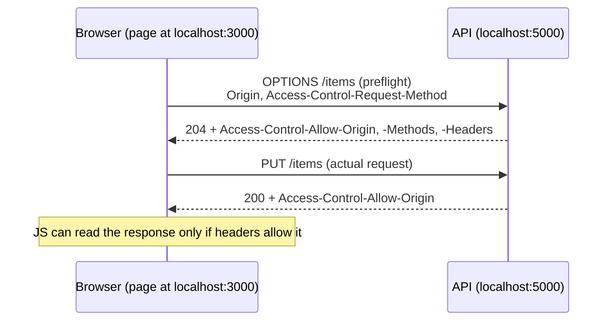

# CORS

CORS (Cross-Origin Resource Sharing) is a browser mechanism that lets a server say which other origins may read its responses. It is enforced by the browser, not by the server.

## What it is

An **origin** is scheme + host + port. `https://app.example.com` and `https://api.example.com` are different origins. So are `http://localhost:3000` and `http://localhost:5000`.

By default, browsers use the **same-origin policy**: JavaScript on one origin can't read responses from another. CORS is the opt-in relaxation of that.



## Simple vs preflighted requests

- **Simple** requests (e.g. GET/POST with basic headers and content types like form data) are sent directly; the browser then checks the response headers.
- Anything else (e.g. `PUT`, `DELETE`, `Content-Type: application/json`, custom headers like `Authorization`) triggers a **preflight**: an `OPTIONS` request first. If the preflight response doesn't allow it, the real request is never sent.

JSON `POST` requests are a common surprise: `Content-Type: application/json` makes them non-simple.

## Response headers

| Header | Meaning |
|---|---|
| `Access-Control-Allow-Origin` | which origin may read the response (one origin, or `*`) |
| `Access-Control-Allow-Methods` | methods allowed (preflight response) |
| `Access-Control-Allow-Headers` | request headers allowed (preflight response) |
| `Access-Control-Allow-Credentials` | `true` to allow cookies / auth with the request |
| `Access-Control-Max-Age` | how long the browser may cache the preflight result |

Rules that cause trouble:

- With credentials (cookies), `Allow-Origin` can't be `*`. It must be the exact origin.
- The client must also opt in: `fetch(url, { credentials: "include" })`.
- If the server varies `Allow-Origin` per request, it should send `Vary: Origin`.

## Example (Express)

```js
const express = require("express");
const cors = require("cors");

const app = express();

app.use(
  cors({
    origin: "http://localhost:3000",
    credentials: true,
  })
);
```

This uses the `cors` npm package. Register it before your routes so preflight requests are handled.

## Common mistakes

- Thinking CORS protects the API. It only controls what *browsers* let scripts read. `curl`, Postman, and other servers ignore it entirely.
- "Fixing" it on the client side. The fix is in the server's response headers (or a dev proxy).
- Setting the header only on success responses. Error responses need it too, or the browser reports a CORS error that hides the real error.
- Wildcard `*` combined with credentials.
- Forgetting that a redirect during a preflight can fail it.

## Practical notes

- During development, a dev-server proxy (same origin from the browser's view) avoids CORS entirely.
- "Blocked by CORS policy" in the console usually means the request itself may have reached the server; the browser just refused to expose the response. Check the Network tab and server logs.

## When to use it

- Your frontend and API are on different origins and the browser must call the API directly.

## When not to use it

- If you can serve both from the same origin (or reverse-proxy the API under the same host), you don't need it.

## Remember

- Browser rule, server headers.
- JSON + `Authorization` header = preflight.
- Credentials need an explicit origin, never `*`.

## Related

- [Debugging CORS errors](../../debugging/frontend/cors-errors.md)
- [HTTP basics](http-basics.md)
- [Cookies and sessions](../authentication/cookies-and-sessions.md)

## References

- MDN: Cross-Origin Resource Sharing (CORS)
- Fetch Standard (WHATWG)
