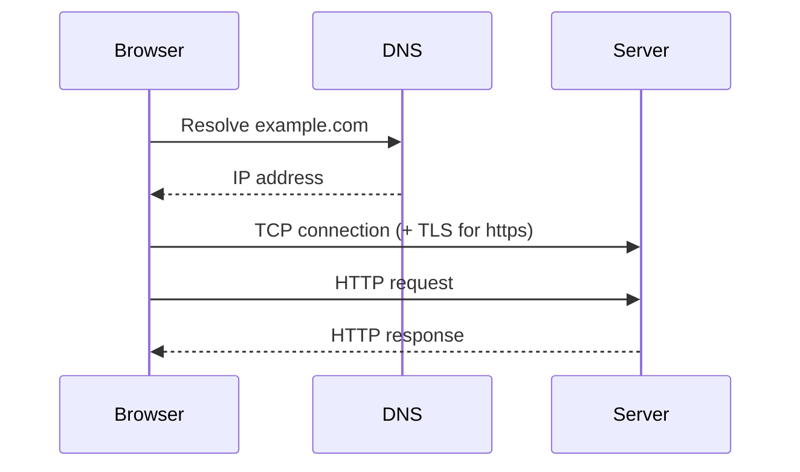

# HTTP Basics

HTTP is a request/response protocol. A client sends a request, a server sends back one response. Each exchange is independent; the protocol itself keeps no memory between requests.

## What it is

A request has a method, a target, headers, and optionally a body. A response has a status code, headers, and optionally a body.

```
GET /api/users/42 HTTP/1.1
Host: example.com
Accept: application/json

HTTP/1.1 200 OK
Content-Type: application/json

{"id": 42, "name": "..."}
```



Before the request is sent, the client needs an IP ([DNS](../../computer-science/networking/dns.md)), a connection ([TCP](../../computer-science/networking/tcp-vs-udp.md)), and for HTTPS a TLS handshake.

## Stateless, but apps need state

Because HTTP is stateless, "who is this user?" has to be carried in each request. Usually via a cookie or an `Authorization` header. See [cookies and sessions](../authentication/cookies-and-sessions.md).

## Headers worth knowing

| Header | Direction | Purpose |
|---|---|---|
| `Host` | request | which site on this server |
| `Content-Type` | both | format of the body (`application/json`) |
| `Accept` | request | formats the client can handle |
| `Authorization` | request | credentials (`Bearer <token>`) |
| `Cookie` / `Set-Cookie` | request / response | send / store cookies |
| `Cache-Control` | both | caching rules |
| `Location` | response | redirect target, or new resource URL |
| `Origin` | request | where a cross-origin request came from ([CORS](cors.md)) |

Header names are case-insensitive.

## HTTP versions

- HTTP/1.1: text-based, one request at a time per connection (browsers open several connections).
- HTTP/2: binary framing, multiple requests multiplexed on one connection.
- HTTP/3: same semantics, runs over QUIC (UDP-based).

Methods, status codes, and headers mean the same across versions. That's why most application code doesn't care which one is in use.

## Common mistakes

- Treating a `200` as success without checking the body of an API that wraps errors.
- Forgetting `Content-Type: application/json` on requests with a JSON body, so the server doesn't parse it.
- Putting secrets in URLs (query strings end up in logs and history).
- Assuming `GET` requests can't have side effects because they shouldn't. Servers can do anything; the convention is just a convention that caches and crawlers rely on.

## Practical notes

- `curl -i URL` shows response headers. `curl -v` shows the request too.
- Browser devtools Network tab shows the same, plus timing.

## Remember

- One request, one response, no built-in memory.
- State comes from cookies or tokens.
- Look at headers before guessing.

## Related

- [HTTP methods](http-methods.md)
- [HTTP status codes](http-status-codes.md)
- [CORS](cors.md)

## References

- RFC 9110: HTTP Semantics
- MDN: HTTP overview
