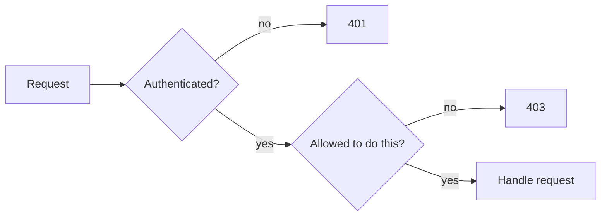

# Authentication vs Authorization

Authentication: who are you? Authorization: what are you allowed to do?

## Comparison

| | Authentication (authn) | Authorization (authz) |
|---|---|---|
| Question | Who is this? | Is this identity allowed to do this? |
| Happens | first | after authentication |
| Inputs | password, token, key, biometric | identity, roles, permissions, resource |
| Failure code | `401` | `403` |
| Example | logging in | only admins can delete users |

## Why the distinction matters

Most real bugs are authorization bugs on top of working authentication. The user is properly logged in; the code just never checks whether *this* user may touch *this* record.

## Common models

- **Role-based (RBAC)**: users have roles (`admin`, `editor`), roles have permissions. Simple, coarse.
- **Ownership checks**: "users can edit their own posts". Needs the resource, not just the role.
- **Attribute-based / policy-based**: rules using user, resource, and context attributes. More flexible, more complex.

## Common mistakes

- Checking authorization only in the UI (hiding a button). The API must check too.
- Checking the role but not ownership: `GET /orders/123` returns any order to any logged-in user. This is a broken access control issue, often called IDOR (insecure direct object reference).
- Trusting IDs or roles sent by the client in the request body.
- Returning `403` for unauthenticated requests, or `401` for forbidden ones.
- Authenticating once at login and never re-checking (permissions change, users get disabled).

## Practical notes

- Do authorization checks on the server, close to the data access, every time.
- Default deny: a new route should require explicit permission rather than be open until someone remembers to lock it.
- Sometimes returning `404` instead of `403` is used to avoid revealing that a resource exists. Decide per case.
- Middleware is a good place for authentication (attach `req.user`). Authorization often needs the loaded resource, so it may live in the handler or a service layer.

## Remember

- Authn = identity. Authz = permission.
- 401 vs 403.
- Every request needs an authz check, on the server.

## Related

- [Cookies and sessions](cookies-and-sessions.md)
- [JWT vs sessions](jwt-vs-sessions.md)
- [HTTP status codes](../apis/http-status-codes.md)

## References

- OWASP Top 10: Broken Access Control
