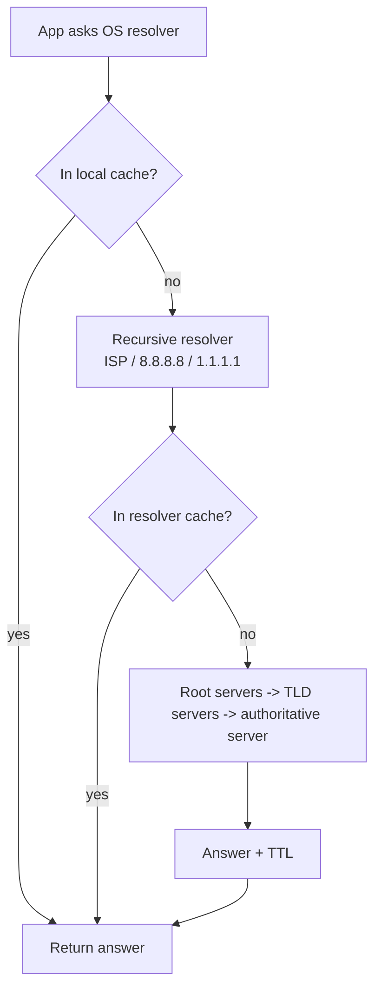

# DNS

DNS turns names (`example.com`) into records, most commonly IP addresses. It's a distributed, cached, hierarchical database.

## How a lookup works



- **Recursive resolver**: does the work on behalf of clients and caches results.
- **Authoritative server**: holds the actual records for a zone.
- **TTL**: how long an answer may be cached, in seconds.

## Record types

| Type | Purpose | Example |
|---|---|---|
| A | name → IPv4 | `example.com → 192.0.2.10` (documentation-range address) |
| AAAA | name → IPv6 | |
| CNAME | alias to another name | `www → example.com` |
| MX | mail servers | |
| TXT | free text (SPF, domain verification) | |
| NS | which servers are authoritative | |

## Commands

```bash
dig example.com                 # full answer with details
dig +short example.com A        # just the A record values
dig @1.1.1.1 example.com        # ask a specific resolver
dig +trace example.com          # follow delegation from the root
dig example.com MX
nslookup example.com            # older tool, available on Windows too
```

`dig +short` is good for scripts and quick checks. `dig @resolver` helps tell whether a problem is your local resolver or the record itself.

## Common mistakes

- Changing a record and expecting instant effect. Old answers stay cached until TTL expires (lowering TTL *before* a planned change helps).
- Putting a CNAME at the zone apex (`example.com` itself) alongside other required records. It's not allowed by the DNS spec; some providers offer "ALIAS"/"ANAME" as a proprietary workaround.
- Testing with the browser and forgetting browser/OS caches. Try `dig` for the authoritative truth.
- Assuming DNS uses only UDP. It uses UDP by default and falls back to TCP for large responses, among other cases.
- Confusing DNS problems with connection problems: "site can't be reached" with a correct IP means not a DNS issue.

## Practical notes

- `/etc/hosts` overrides DNS on the local machine. Worth checking when a name resolves oddly.
- Different networks may return different answers (split-horizon DNS, geo-based routing).
- DNS is unencrypted by default; DoH/DoT encrypt queries to the resolver.
- Flushing local cache commands vary by OS and version. Look them up for the specific system.

## Remember

- Names → records, cached according to TTL.
- `dig` beats guessing.
- Propagation delay is really cache expiry.

## Related

- [HTTP basics](../../backend/apis/http-basics.md)
- [TCP vs UDP](tcp-vs-udp.md)

## References

- RFC 1034 and 1035 (DNS concepts and implementation)
- `man dig`
