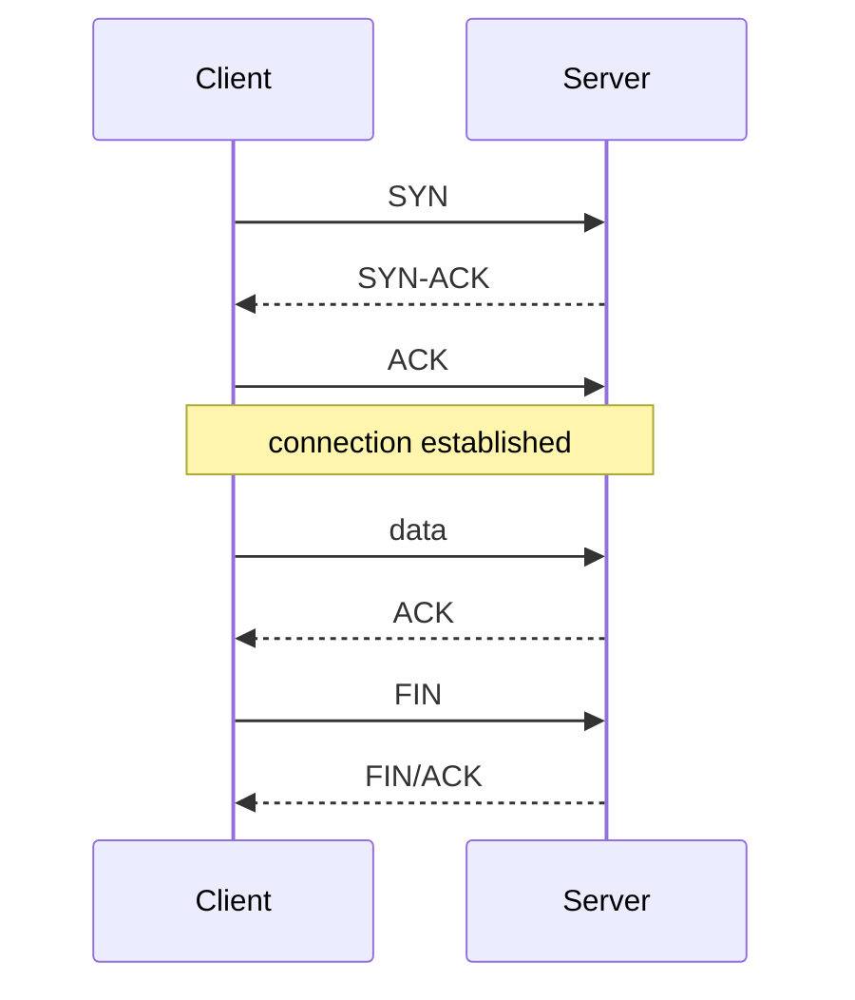

# TCP vs UDP

Both sit on top of IP and carry data between ports on two hosts. TCP adds reliability and ordering; UDP adds almost nothing.

## Comparison

| | TCP | UDP |
|---|---|---|
| Connection | yes (handshake first) | no |
| Delivery | reliable: lost packets are retransmitted | best effort: may be lost, duplicated, reordered |
| Ordering | in-order byte stream | each datagram independent |
| Flow / congestion control | yes | no (application's problem) |
| Overhead | higher | lower |
| Message boundaries | none (it's a stream) | preserved (one send = one datagram) |
| Used by | HTTP/1.1, HTTP/2, SSH, SMTP, most databases | DNS queries, streaming/voice/games, QUIC (HTTP/3) |

## TCP connection



The handshake costs a round trip before any data flows (HTTPS adds TLS on top). That's one reason connection reuse (keep-alive, HTTP/2) matters.

## Practical implications

- TCP is a **stream**. Two `send()` calls can arrive as one `recv()` and vice versa. Protocols on top must define their own message framing (length prefix, delimiters, HTTP's `Content-Length`).
- UDP gives you datagrams: you get whole messages or nothing. But you also handle loss and ordering yourself if you need them.
- TCP head-of-line blocking: a lost packet delays everything behind it in that connection. One reason QUIC moved to UDP with per-stream handling.
- "UDP is faster" is a simplification. It has less overhead and no retransmission delay, which suits real-time data where late data is worthless. For bulk transfer TCP is generally the right tool.

## Common mistakes

- Assuming TCP preserves message boundaries.
- Assuming UDP packets arrive or arrive in order.
- Forgetting UDP can be blocked or rate-limited by firewalls more often than TCP.
- Confusing "connection refused" (nothing listening, got a reset) with "timed out" (no response at all, often firewall or routing).

## Debugging

```bash
nc -vz example.com 443        # can we open a TCP connection?
nc -u -v host 53              # UDP (results are less conclusive; no handshake)
ss -tan                       # TCP sockets and states (Linux)
```

`nc -vz host port` tries to connect and reports success or failure without sending data.

## Remember

- TCP: reliable ordered stream. UDP: unreliable datagrams.
- The choice is about what should handle loss: the protocol or the application.
- HTTP/3 runs over UDP (via QUIC) and re-implements reliability itself.

## Related

- [DNS](dns.md)
- [HTTP basics](../../backend/apis/http-basics.md)
- [Port already in use](../../debugging/node/port-already-in-use.md)

## References

- RFC 9293 (TCP), RFC 768 (UDP), RFC 9000 (QUIC)
