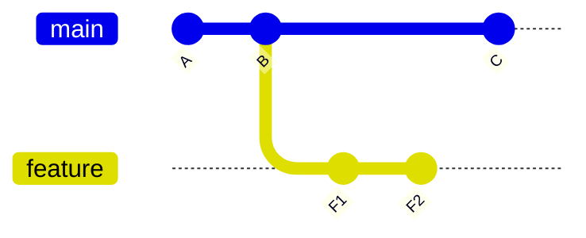

# Git Rebase

Rebase takes commits from your branch and replays them on top of another base commit. The result is a linear history with *new* commits (new hashes).

## Merge vs rebase

Starting state: `feature` branched from `main`, and `main` has moved on.



- `git merge main` (while on `feature`) adds a merge commit that joins both lines. History is accurate, but branchy.
- `git rebase main` (while on `feature`) makes F1 and F2 into F1' and F2' on top of C. History reads as if you started from C.

```bash
git switch feature
git rebase main
```

## Interactive rebase

```bash
git rebase -i HEAD~4
```

Opens a list of the last four commits so you can:

| Action | Effect |
|---|---|
| `pick` | keep as is |
| `reword` | change the message |
| `squash` | combine into the previous commit, edit message |
| `fixup` | combine into the previous commit, discard message |
| `drop` | remove the commit |
| reorder lines | reorder commits |

Useful for tidying local commits before opening a pull request.

## When conflicts happen

Rebase replays commits one at a time, so you may resolve conflicts per commit.

```bash
# fix files, then
git add <files>
git rebase --continue

# or bail out and return to the pre-rebase state
git rebase --abort
```

## The golden rule

Don't rebase commits that other people have based work on. Rebase rewrites those commits; teammates' copies will diverge from yours.

If you rebase a branch you already pushed (your own feature branch), the push will be rejected and you'll need:

```bash
git push --force-with-lease
```

`--force-with-lease` refuses to overwrite the remote if it contains commits you haven't seen. Safer than plain `--force`.

## Common mistakes

- Rebasing `main` or any shared branch.
- Using plain `--force` and overwriting a teammate's commits.
- Rebasing a huge branch with many conflicts one commit at a time, when a single merge would have been simpler.
- Squashing everything so history loses useful information. Squash noise ("fix typo", "wip"), keep meaningful steps.
- Panicking mid-rebase: `git rebase --abort` returns things to where they were.

## Practical notes

- `git pull --rebase` fetches, then rebases local commits on top of upstream instead of creating a merge commit. Can be set as a default via config.
- After a bad rebase, the old commits usually still exist. [Reflog](git-recovering-lost-work.md) can find them (`ORIG_HEAD` also points to the pre-rebase tip right after).
- `git rebase --onto` moves a range of commits to a different base. Rare, but useful for branches stacked on other branches.

## When to use it

- Updating a personal feature branch with the latest `main`.
- Cleaning up local commits before sharing.

## When not to use it

- Shared/public branches.
- When exact history (who merged what, when) matters to you or your team's policy.

## Remember

- Rebase = new commits, same changes.
- Local and unshared only.
- `--abort` and reflog are the escape hatches.

## Related

- [Undoing changes](git-undoing-changes.md)
- [Recovering lost work](git-recovering-lost-work.md)
- [Git cheatsheet](git-cheatsheet.md)

## References

- Pro Git: Git Branching - Rebasing
- `git help rebase`
