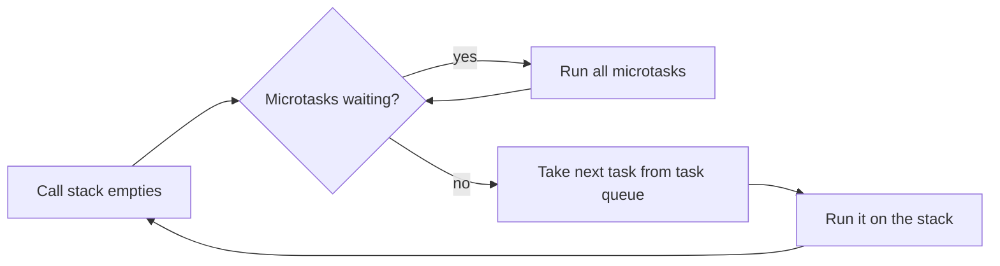

# Event Loop

JavaScript runs your code on a single thread. The event loop is what lets it handle timers, network responses, and user input without blocking on each one.

## What it is

Pieces involved:

- **Call stack**: where synchronous code runs. One thing at a time.
- **Task queue** (macrotasks): callbacks from `setTimeout`, `setInterval`, I/O, UI events.
- **Microtask queue**: promise callbacks (`.then`, `.catch`, code after `await`) and `queueMicrotask`.
- **Event loop**: when the stack is empty, it takes the next thing to run.



The key rule: after each task, the engine drains the **entire** microtask queue before moving to the next task (and before the browser gets a chance to render).

## Example

```js
console.log("A");

setTimeout(() => console.log("B"), 0);

Promise.resolve().then(() => console.log("C"));

console.log("D");
```

Output: `A D C B`

- `A` and `D` are synchronous.
- The promise callback is a microtask, so it runs as soon as the stack is empty.
- The timeout callback is a task, so it runs after the microtasks.

`setTimeout(fn, 0)` does not mean "now". It means "as soon as possible, after the current work and any microtasks".

## Why it matters

- Explains output-order puzzles.
- Explains why a long synchronous loop freezes the page or blocks a Node server: nothing else can run until the stack is empty.
- Explains why `await` in one function doesn't block the rest of the program.

## Common mistakes

- Assuming `setTimeout(..., 100)` fires at exactly 100 ms. It is a minimum delay.
- Doing heavy CPU work in a request handler or event handler. Everything else waits.
- Endlessly scheduling microtasks (a promise chain that keeps re-queuing itself). Rendering and timers starve, because microtasks always drain first.
- Assuming `async` makes code run in parallel. It doesn't; it only lets other work run while awaiting.

## Practical notes

- In Node.js the loop has phases (timers, poll, check, etc.). `setImmediate` runs in the check phase. `process.nextTick` has its own queue that runs before promise microtasks. Details depend on Node version, so check the official docs before relying on exact ordering.
- Browsers also schedule rendering between tasks, and `requestAnimationFrame` callbacks run before paint.
- For CPU-heavy work: Web Workers in the browser, `worker_threads` or child processes in Node.

## When to care

- Debugging ordering issues between timers, promises, and events.
- Anything that feels "frozen" (look for long synchronous work).

## Remember

- Stack first, then all microtasks, then one task, repeat.
- Promises = microtasks. Timers = tasks.
- Single thread; blocking it blocks everything.

## Related

- [Promises and async/await](promises-and-async-await.md)
- [Closures](closures.md)

## References

- MDN: "Concurrency model and the event loop"
- Node.js docs: "The Node.js Event Loop"
